# 2021 Movie Website Project

> SSAFY 1학기 최종 프로젝트로 영화 추천 사이트를 구현하는 과정을 README로 작성한다.


## Project Period

2021.11.17 (수) ~ 2021.11.25 (목)


## Contributors

- 박동준 (팀장)


- 정재호


## ❗시작 전 Check List


### ☑️ Front - end

```bash
$ cd front-end
$ npm install
$ npm install bootstrap-vue
$ npm install vue-glide-js
$ npm install vue-carousel-3d
$ npm install axios
$ npm install lodash
$ npm install jwt-decode
```

> Front-end를 수행하기 위해 필요한 패키지들의 설치를 실행했습니다.


### ☑️ Back - end

```bash
$ cd back-end
$ python –m venv venv
$ pip install –r requirements.txt
$ source venv/Scripts/activate
$ python manage.py makemigrations
$ python manage.py migrate

$ python manage.py runserver
```

> Back-end를 수행하기 위해 필요한 필수 절차를 실시했습니다.


```sqlite
$ sqlite3 db.sqlite3
>> .mode csv
>> .import vote_data.csv movies_movie
>> .import genre.csv movies_genre
>> .import grade.csv movies_grade
>> .import movie_genre.csv movies_movie_genre
>> .import movie_grade.csv movies_movie_grade
```

> 크롤링을 통해 얻은 데이터를 model.py로 생성한 데이터베이스에 추가하는 작업을 실시했습니다.


---

## ☑️1. 개요


### 1.1 팀원 설명


#### 박동준 : Front-end

- Vue 클라이언트 구현
- Css - Modeling
- Web - Design


#### 정재호 : Back-end

- Django 서버 구현

- Web - Crawling
- Css - Modeling
- Web - Design


### 1.2 목표 서비스

> 0. 시작 페이지

```
1. 동적 화면 생성
2. JWT를 사용한 회원가입 / 로그인
3. 로그인 정보에 따른 Navbar 표시 변경
```


> 1. 영화 조회 서비스

```
1. 최신 영화 조회
2. 장르별 영화 조회
3. 등급별 영화 조회
4. 영화 상세 조회
5. 영화 예고편 조회 및 유사 장르 영화 조회
6. 영화 배우 프로필 조회
7. 검색창을 통한 영화 조회
```


> 2. 커뮤니티

```
1. 영화 관람평 작성
2. 관람평 작성시 영화 검색 기능 설정
3. 시청 기록 및 게시글을 통해 갤러리 생성
4. 게시글을 통해 타 유저의 프로필 확인
5. 리뷰활동을 통해 평점 및 댓글 생성을 통한 의사소통 구현
```


> 3. 영화 추천 서비스

```
1. 오늘의 유저의 추천 영화
2. 요일별 장르 추천
3. 국가별 영화 추천
4. 게임을 통한 영화 전문가 선택 및 전문가의 추천 영화
```


> 4. 개인 프로필 페이지

```
1. 인스타 느낌의 개인 프로필 페이지 생성
2. 개인이 좋아요 눌린 영화 조회
3. 개인이 생성한 게시글 조회
4. 개인이 찜한 영화 조회
5. 타 유저 팔로우 기능 생성 및 팔로워, 팔로잉 유저 목록 조회
```


### 1.3 프로젝트 구조

### 1) 컴포넌트 구조

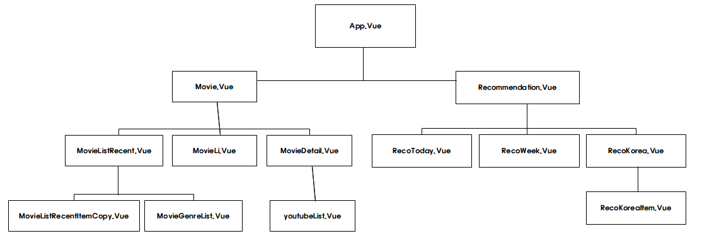

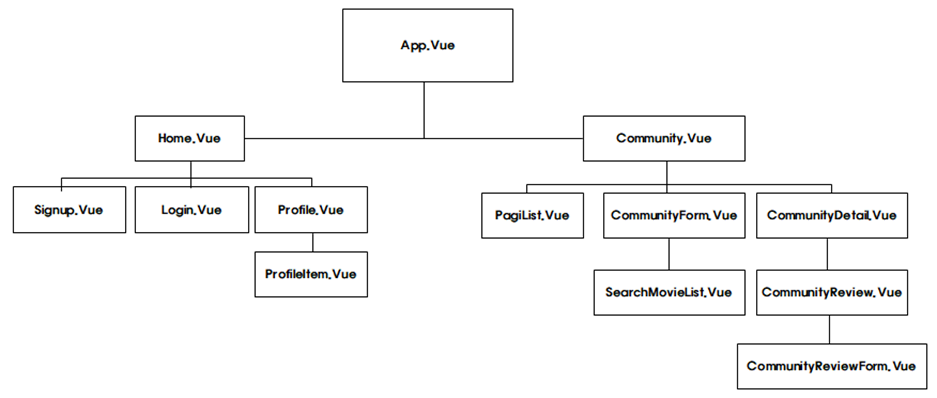


### 3-2) ERD Model (DB Model)

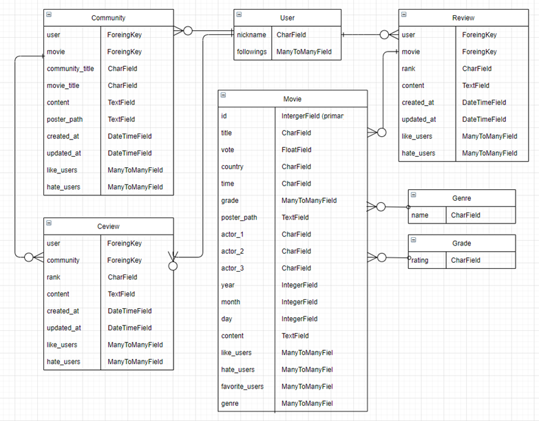


------

## ☑️2. 크롤링


### 2.1 데이터 구축 방향

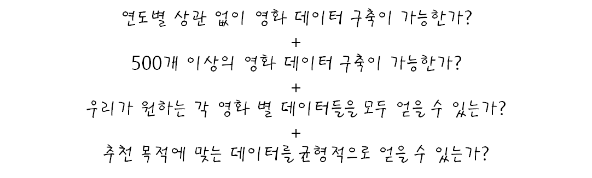


### 2.2 데이터 크롤링

- 네이버 영화 홈페이지를 통해 30,000 개의 영화 데이터 크롤링


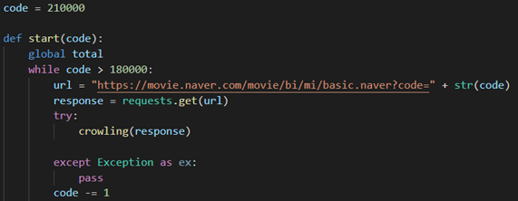 

> url과 code 값을 통해 총 30,000개의 영화 데이터 조회


 

> BeautifulSoup을 활용해 페이지 내 필요 데이터 선택 및 저장


### 2.3 데이터 전처리

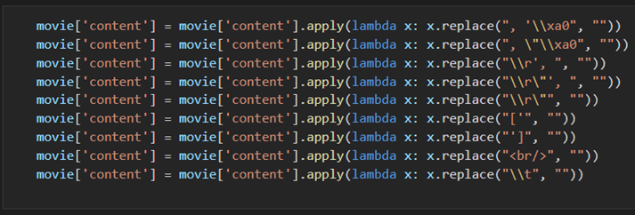 

> Pandas 문법을 통한 데이터 전처리


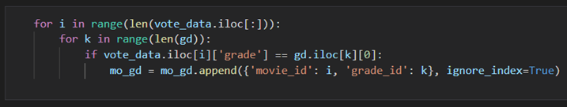 

> 알고리즘을 활용한 데이터 전처리


### 2.4 데이터 구축

#### 모델에 따른 여러 데이터 구축

1. vote_data.csv    	:   movies_movie
2. genre.csv               :   movies_genre
3. grade.csv               :   movies_grade
4. movie_genre.csv   :   movies_movie_genre
5. movie_grade.csv   :   movies_movie_grade


---

## ☑️3. 시작 페이지


### 3.1 시작 페이지 구축 방향

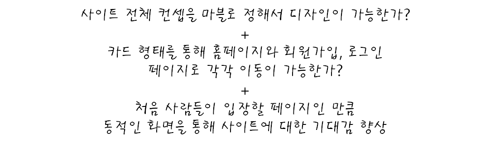


### 3.2 Navbar

#### - 로그인 전

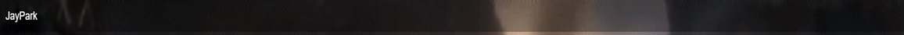


#### - 로그인 후

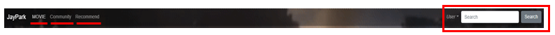

```
조건문을 걸어 만약에 로그인이 되어 있지 않은 상황이면 Navbar가 비어있도록 설정했으며,

로그인이 되어 있는 상황이면 Movie, Community, Recommend로 이동 할 수 있는 값과,
User Dropbox를 통해 자신의 profile 페이지와 Logout도 가능하게 했으며 검색창도 활성화시켜줬습니다.
```


### 3.3 시작 페이지

#### 컨셉에 어울리는 동적인 화면, 각각의 사이트로 이동할 카드 생성


```
마블 캐릭터들을 중점을 두고 디자인에 대해 회의를 시작했습니다.

회의를 시작하면서 자연스럽게 “마블은 동적이다” 라는 아이디어를 얻을 수 있었고,  처음으로 보여지는 화면인 Home에 gif를 사용해 동적 이미지를 넣을 수 있었습니다.

모든 화면이 동적이면 어지러울 가능성 때문에, 첫 화면만 동적으로 넣고 나머지는 jpg 지정해줬습니다.
```

**<주요 코드>**

```vue
<!-- Home.vue -->

<template>
  <div id="home">
    ...
  </div>
</template>

<style lang="scss" scoped>
#home {
    background-image: url("https://...5e6a");
    height: 100vh;
    background-repeat: no-repeat;
    background-size: cover;
    margin-top: 0px!important;
}
</style>
```


### 3.4 Sign-up


```
‘Animation: fadeInDown’ 을 사용해 Sign-up 창이 천천히 화면에 생성되게 지정해주었습니다.

V-if문을 사용해 비밀번호와 비밀번호 확인란의 값이 다른 경우 “비밀번호가 일치하지 않습니다!!!” 라고 언급을 할 수 있게 지정해주었습니다.

모든 장고와 뷰의 연결을 axios를 통해 지정해주었고, 데이터를 받아 왔습니다.
```

**<주요 코드>**

```vue
<!-- Signup.vue -->

<template>
  <div v-if="this.credentials.passwordConfirmation.length > 2">
    <p v-if="credentials.password===credentials.passwordConfirmation"
       style="color: green"
    >
      비밀번호가 일치합니다.
    </p>
    <p v-else-if="credentials.password!=credentials.passwordConfirmation"
       style="color: red"
    >
      비밀번호가 일치하지 않습니다!
    </p>
  </div>
</template>

<script>
  methods: {
    signup: function () {
      axios({
        method: 'post',
          url: 'http://127.0.0.1:8000/accounts/signup/',
          data: this.credentials
        })
          .then(res => {
            this.$router.push({ name: 'Login' })
          })
          .catch(err => {
            this.passwordToggle = true
          })
    },
  },
</script>

<style lang="scss" scoped>
    .card {
        margin-bottom: 20px;
        border: none;
        animation: fadeInDown 2s;
    }
</style>
```


### 3.5 Log-in


```
V-if문을 활용해 DB에 저장되어 있는 password값과 입력한 password값이 다른 경우 
“비밀번호가 일치하지 않습니다!!!”를 반환할 수 있게 지정해줬습니다.
```

**<주요 코드>**

```vue
<!-- Login.vue -->

<template>
  <input type="text" name="" placeholder="Username"
         v-model="credentials.username"
  >
  <input type="password" name="" placeholder="Password"
         v-model="credentials.password"
         @keyup.enter="login"
  >
  <p v-if="passwordToggle===true"
     style="color: red"
  >
  <a class="forgot text-muted" @click="goSignup">
    회원이 아니신가요? 회원가입 하러 갈까요?
  </a>
  </p>

</template>
```


---

## ☑️4. 홈페이지


### 4.1 Movies-1


```
Carousel-3d를 활용해 최근에 나온 영화를 평점이 높은 순으로 지정해 애니메이션 효과를 주면서 첫 페이지에 보여줬습니다.

여기서 영화 포스터를 클릭하게 되면 바로 Movie-Detail 홈페이지로 이동할 수 있게 해주었습니다.
```


### 4.2 Movies-2


```
장고에서 장르별 데이터를 선별해 뷰에서 받을 수 있게 지정해줬습니다.

장르별, 등급별 선택이 가능하며, 예를 들어, 액션에 15세 이상 관람가능한 영화를 조건을 중복해서 선택 가능하도록 지정해줬습니다.

그리고 카드에 좋아요, 싫어요, 즐겨찾기 기능을 추가했으며, 사진 아래부분을 흐리게 하여 자연스럽게 글과 사진을 나타낼 수 있게 지정해줬습니다. 그리고 커서를 주어줬을 때, 카드가 커지도록 효과를 지정했으며, Go to Detail 버튼을 클릭하면 그 영화에 맞는 Movie-Detail 홈페이지로 이동 할 수 있는 기능을 구현했습니다.
```


### 4.3 Movie-Detail


```
각각의 영화에 대한 정보를 보여주는 Detail 페이지를 생성했습니다.
예를 들어, 영화 제목, 줄거리, 관람객 평점, 출연배우, 장르 뿐만 아니라 개봉일과 런타임, 포스터를 보여줬습니다.

유튜브 아이콘을 선택하게 되면, 그 영화에 대한 유튜브 관련 영상을 보여줄 수 있게 구현했습니다.

또한, 그 영화와 비슷한 장르에 해당하는 영화 8개씩 추천하는 기능 또한, 구현했습니다.
```


---

## ☑️5. 커뮤니티


### 5.1 Community


```
존재하는 커뮤니티 게시글과 Pagination을 연결해 한 페이지에 5개의 게시물만 볼 수 있도록 지정해주었습니다.

각각의 게시글마다 어떤 유저가 작성했는지를 보여줬으며, 그 게시글을 클릭했을 때, 그 유저의 프로필 페이지로 이동할 수 있도록 지정해주었습니다.

또한, 제일 우측의 Detail 버튼을 클릭했을 때는 그 게시글의 디테일 페이지로 이동할 수 있도록 지정했습니다.
```


### 5.2 Community - Create

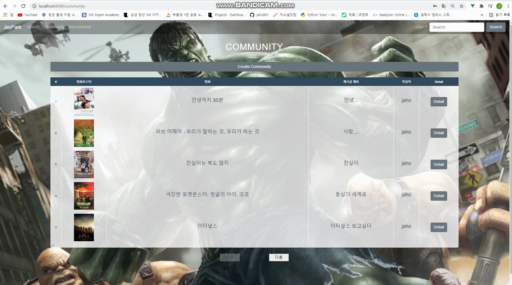

```
게시글 작성 페이지입니다. 위 페이지의 경우 ‘영화검색하기’ 버튼을 누를 때, 단어별로 엔터 입력 시 검색이 가능하게 만들었습니다.
검색하여 나온 영화의 카드를 클릭하면 자동으로 작성 란 포스터 창에 영화정보가 기입이 되고,
혹여 없는 영화를 검색할 때는 경고창을 띄울 수 있도록 로직을 작성했습니다.
```


### 5.3 Community - Detail

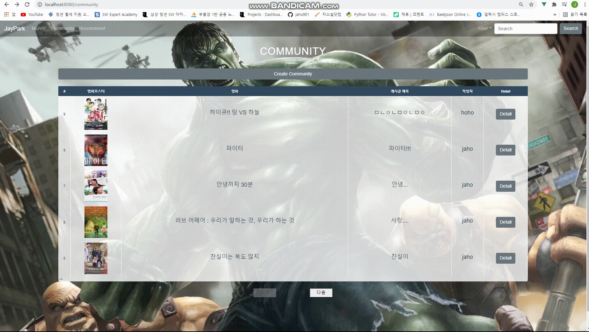

```
유저가 작성한 영화 포스터와 제목, 그리고 게시글의 제목과 내용을 보여주는 커뮤니티 디테일을 생성했습니다.

각 게시글에도 좋아요와 싫어요를 누를 수 있고,

그 게시글에 리뷰를 생성해 의사소통 또한, 가능합니다. 자신이 생성한 리뷰는 수정 삭제가 가능합니다.
```


---

## ☑️6. 추천 페이지


### 6.1 Recommend - User of Today


```
커뮤니티에 글을 많이 쓴 사람일 수록, 영화를 진심으로 생각하고 있으며, 영화에 대한 지식이 높다고 생각합니다. 그렇기 때문에, 커뮤니티에 쓴 글이 많은 순으로 유저를 10명 뽑고, 그 중 1명을 랜덤으로 선택하면서 그 유저가 좋아요를 누른 영화를 vue-glide 를 사용해 보여주었습니다.

커뮤니티에 쓴 글에 따라 10명의 유저는 매번 변경될 수 있고, 다양한 유저의 추천 영화 목록을 사람들에게 보여주고 싶은 마음으로 추천 알고리즘을 구현하게 되었습니다.
```


### 6.2 Recommend - Week of Day


```
각각의 요일을 크롤링 해서 각 요일에 맞는 영화장르에 따른 영화를 랜덤으로 추천해주는 알고리즘 또한, 구현했습니다. 그리고 총 추천된 12개의 영화를 cube-container를 사용해 추천해줬습니다.

월요일 : 일주일의 시작이지만, 스트레스 받지 말고 아무 생각 없이 빠질 수 있게 SF와 서스펜스 추천
화요일 : 아직 4일이나 남은 평일, 화끈함으로 극복할 수 있게 액션, 전쟁, 모험 추천
수요일 : 평일 5일 중 반 이상 지나갔음의 감동을 유지하며 가족, 멜로/로멘스, 드라마, 다큐멘터리 추천
목요일 : 하루만 버티면 주말이 찾아오니 계속 웃을 수 있게 코미디, 애니메이션, 판타지 추천
금요일 : 일주일이 끝났기 때문에, 스트레스 해소를 위해 공포, 스릴러 추천
토요일 : 주말의 시작! 신나게 놀기 위해 공연과 뮤지컬 추천
일요일 : 계속해서 두근거림, 긴장감을 통해 월요병을 해소하기 위해 범죄, 미스터리 추천
```


### 6.3 Recommend - Korea


```
국뽕을 잊지말자!!
알고보면, 대중화가 되지 않은 우리나라 영화 중에서도 재밌는 영화들이 다수 존재하고, 이 부분을 사람들에게 알려주고 싶은 마음으로 총 200개가 넘는 한국영화들을 lodash를 활용해 계속해서 랜덤으로 보여주는 알고리즘을 구현하게 되었습니다.
```


---

## ☑️7. 프로필 페이지


### Profile


```
개개인의 프로필 페이지에 들어갔을 때, 그 유저가 좋아요를 누른 영화들, 게시글을 작성할 때 사용한 영화들, 그리고 찜한 영화들을 보여주었습니다. 역시, Pagination을 사용해 한 페이지에 최대 6개의 영화 포스터를 보여주었습니다.

팔로우 버튼을 활용해 각각의 유저를 팔로우한 유저의 수와 그 유저들의 리스트, 그 유저가 팔로잉한 유저의 수와 그 유저들의 리스트를 확인할 수 있습니다.
```


---

## 오류과정 및 디버깅


#### 1. 게임 생성

> 영화 정보를 통한 영화 제목 맞추기 게임을 생성해 유저의 순위를 지정해주고, 그 유저들은 많은 영화를 알고, 신뢰도가 있는 사람으로 생각하므로 상위 랭킹 유저들의 좋아요 누른 영화 정보를 얻어올려 했지만, 시간 부족으로 인해 아쉽게 구현하지 못했습니다.


#### 2. NavBar 검색창

> NavBar에 존재하는 검색창을 통해 검색창에 존재하는 단어로 그 단어가 포함되어 있는 영화 리스트를 보여주고, 원하는 영화를 클릭했을 때, 그 영화 디테일로 이동하는 알고리즘을 구현하려 했지만, 못했습니다.


#### 3. 영화 배우 조회

> 각각의 영화들에 출연한 배우들의 이름은 존재하지만, 크롤링을 통해 영화 데이터를 받아왔기 때문에 다시 출연자들의 사진들을 들고오기에는 어려움이 존재했습니다.


## 느낀점 및 배운점


#### 박동준

> “맛있었다”
>
> 한 학기 동안 배운 개념들을 다시 곱씹으면서 극 이상주의인 나와 극 현실주의인 재호가 만나 서로 만족 할 결과물을 만들 수 있었다는 것이 뿌듯합니다.
>
> 많지 않은 지식으로 결과물을 내기 위해서 노력하면서 다시 한번 배울 수 있는 좋은 기회였습니다.
>
> 특히 서로간의 생각을 이해시키기 위해서 설명하는 과정에서 개발자는 의사소통 능력이 정말 중요하다는 것을 다시 한번 자각하였고, 앞으로의 2학기가 더욱 기대가 되어진 1학기 최종 관통 프로젝트였습니다.
>
> 다들 너무 고생하셨고 2학기에도 파이팅입니다!


#### 정재호

> 비전공자 입장에서 SSAFY를 통해 처음으로 개발이라는 항목에 접해봤고, 파이썬을 포함해 알고리즘과 백엔드, 프론트엔드를 학습할 수 있었습니다.
>
> 얕은 지식이었기 때문에, 처음에는 두려움이 앞섰고, 겁이 났습니다. 하지만, 혼자가 아니었고, 많은 사람들의 도움을 통해 한 걸음씩 나아갈 수 있었고, 스스로 문제를 해결할 수 있는 방법 또한, 배울 수 있었습니다.
>
> 백엔드와 프론트엔드에 대한 흥미와 관심 역시 커졌고, 더욱 열심히 해서 남은 프로젝트는 더욱 높은 퀄리티와 좋은 결과를 얻고싶습니다.
